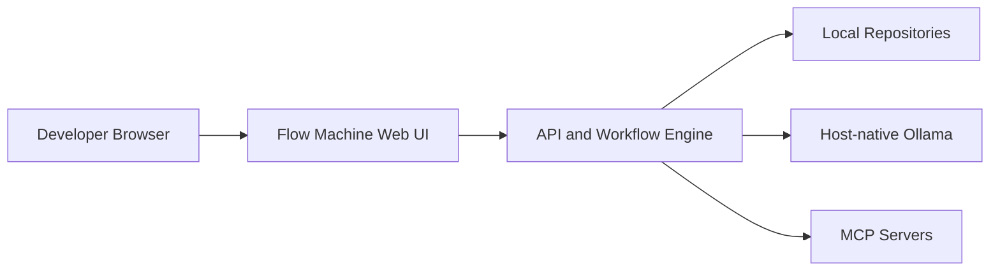

# Flow Machine: Local-First Workflow Automation for Developers

Flow Machine is a local-first workflow automation app for developers. It helps teams build repository-aware workflows with Ollama, MCP integrations, explicit approvals, and private local execution.

Flow Machine runs locally in Podman, uses host-native Ollama by default, and keeps workflows exportable as Git-friendly JSON.

## Quick Start

### Prerequisites

- [Node.js 22+](https://nodejs.org/en/download)
- [Corepack](https://nodejs.org/api/corepack.html) included with Node.js
- [Podman](https://podman.io/getting-started/installation)
- [Ollama](https://ollama.com/download)

### Start the app

```bash
cp .env.example .env
corepack enable
corepack yarn install
corepack yarn local:up
```

Open `http://127.0.0.1:3000`.

Recommended first-run steps:

1. Open Settings and confirm Ollama is reachable.
2. Pull or select a model.
3. Add a local repository.
4. Create or import a workflow.

If port `3000` is already in use, change `FLOW_MACHINE_PORT` in `.env` before starting.

## How It Runs

Flow Machine keeps the app local, talks to a host-native Ollama runtime, and works directly with your local repositories.



## Local Development

Use live reload when working on the web app or API:

```bash
cp .env.example .env
corepack enable
corepack yarn install
corepack yarn local:dev
```

Development URLs:

- Web: `http://127.0.0.1:5173`
- API: `http://127.0.0.1:3000`

`local:dev` starts the shared package watchers, the API in watch mode, and the Vite dev server with HMR.

## Useful Commands

- `corepack yarn local:up` starts the production-like local stack in Podman.
- `corepack yarn local:down` stops the local container stack.
- `corepack yarn local:logs` shows container logs.
- `corepack yarn local:dev` starts live-reload development mode.
- `corepack yarn typecheck` runs the workspace typechecks.

## Environment

The default setup lives in `.env.example`.

- `FLOW_MACHINE_PORT`: app/API port for the local container path.
- `FLOW_MACHINE_PRIVACY_MODE`: `local-first` or `strict-local`.
- `FLOW_MACHINE_REPO_MOUNT`: default workspace root mounted into the app.
- `FLOW_MACHINE_HOST_ACCESS_MOUNT`: broader host path access for registering repositories outside the default workspace.
- `FLOW_MACHINE_DATA_PATH`: local data directory.
- `OLLAMA_BASE_URL`: Ollama endpoint used by the app.

By default, app data is stored in `.flow-machine/data`.

## Suggested GitHub Metadata

Use this in the repository About field:

> Local-first workflow automation for developers with Ollama, MCP integrations, approvals, and private local execution.

Suggested topics:

- `workflow-automation`
- `local-first`
- `developer-tools`
- `ollama`
- `model-context-protocol`
- `mcp`
- `podman`
- `typescript`
- `react`
- `fastify`

## Docs

- [docs/project-plan.md](docs/project-plan.md)

## License

Apache-2.0.
