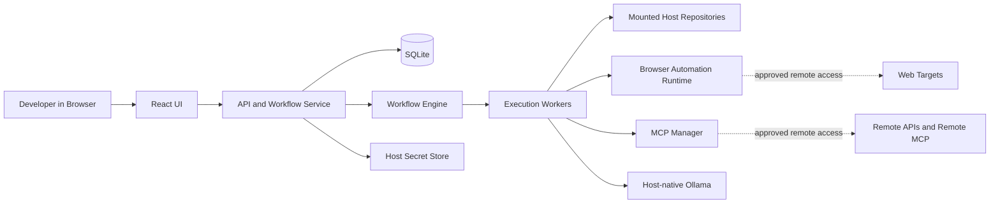

# Flow Machine V1 Project Plan

## Vision

Flow Machine is a local-first workflow platform for developers who want to automate day-to-day work without sending code and context to paid cloud-hosted LLM platforms by default.

The product should feel familiar to users of n8n, while being more explicit about privacy, local execution boundaries, approvals, resource use, and model selection.

## V1 Product Goals

- Run the application locally with Podman.
- Use host-native Ollama by default for better performance and lower onboarding friction.
- Let developers build workflows visually in a React UI.
- Support developer-centric tasks such as file operations, shell commands, Git analysis, HTTP requests, browser automation, and MCP calls.
- Make privacy status obvious at all times.
- Allow both manual approvals and configurable auto-approvals.
- Keep workflows exportable, Git-friendly, and easy to reconstruct on another machine.
- Keep onboarding to a small number of steps and one documented startup command.

## V1 Non-Goals

- Multi-user collaboration and authentication.
- Marketplace or remote task sharing.
- Full air-gapped installation.
- Managed clone repositories.
- Full hard isolation for every task inside separate containers.
- Containerized Ollama as the default runtime.

## Locked Decisions

- Host-native Ollama is the default model runtime.
- Containerized Ollama is a future optional mode, not the default.
- The app runs as a local Podman-hosted application.
- Repositories are mounted from the host for v1.
- Workflows are stored as pretty-printed JSON with stable key ordering.
- Export and restore exclude run history, plaintext secrets, and model binaries.
- Strict local-only mode allows localhost only and blocks all other outbound traffic.
- Web UI only for v1.
- Workflow runs support both full rerun and resume from the last successful node.
- MCP support is first-class and should prioritize VS Code style mcp.json compatibility.
- Browser automation supports both public sites and authenticated sessions.
- Telemetry is disabled for the local product; only explicit user-exported diagnostics are allowed.

## Product Principles

- Performance by default: prefer host-native model execution where it materially improves the user experience.
- Local-first trust: users should always know whether execution is fully local or crossing a network boundary.
- Explainable automation: every step should show what ran, what it touched, and why it failed.
- Minimum-friction onboarding: the repo should support a single documented startup command after environment configuration.
- Git-friendly assets: workflow definitions and reconstructable state should be easy to commit, diff, review, export, and re-import.
- Extensibility without chaos: future custom tasks and future task sharing should be possible without redesigning the core system.

## High-Level Architecture



## Runtime Model

### Host Layer

- Ollama runs on the host by default.
- Local repositories stay on the host and are mounted into the container.
- Secrets are stored outside the container through OS-backed secret storage where available.
- Optional imported files such as mcp.json or .env are copied into app-managed configuration or secret storage, not continuously read from their original location.

### Container Layer

- React frontend served locally.
- Fastify backend and API layer.
- Workflow engine and worker runner.
- SQLite database in a mounted data volume.
- Browser automation runtime.
- MCP management layer.
- Optional runtimes required by MCP servers, especially Node and Python tooling.

### Future Runtime Option

- Optional containerized Ollama mode may be added later for users who prefer a more self-contained stack over raw performance.

## Core Components

### Frontend

- React application with a workflow builder that feels close to n8n.
- Canvas-based editing for nodes, connections, conditions, and execution paths.
- Dedicated views for workflows, run history, approvals, tasks, models, MCP connections, secrets, and settings.
- Persistent privacy indicator that shows whether execution is local-only, using localhost services, or making approved external connections.

### Backend API

- Fastify-based API for workflow CRUD, run orchestration, task execution, approvals, secrets, MCP connections, and model management.
- Server-sent events or WebSocket stream for live workflow progress, logs, and approval prompts.

### Workflow Engine

- Directed graph execution model.
- Supports linear flows, branching, conditions, loops, and bounded agent nodes.
- Persists node state, timing, inputs, outputs, approval checkpoints, retry status, and failure reasons.
- Supports both full rerun and resume from last successful node.

### Execution Workers

- Run workflow nodes in isolated worker processes within the application container.
- Soft resource limits for CPU, memory, concurrency, and timeouts in v1.
- Per-node policies for filesystem scope, network access, secret use, and approval requirements.

### Persistence

- SQLite with WAL mode for local reliability and simple operations.
- Mounted volume for app data and configuration.
- Git-friendly workflow files exported separately from runtime state.

### Secrets Layer

- macOS Keychain on Mac.
- Windows Credential Manager on Windows.
- Encrypted host-side file fallback where required.
- Secrets never stored in plaintext exports.

### Model Gateway

- Default connection to host Ollama.
- Preflight health checks for model service availability.
- Model listing, pull status, and selection in the UI.
- Export includes model manifest, not model binaries.

## Host-Native Ollama Default

### Why It Is The Default

- Better performance on Apple Silicon and Windows machines.
- Lower container size and simpler container lifecycle.
- Better developer experience because model state persists naturally on the host.

### Default Connection Model

- The container connects to the host Ollama endpoint through host.containers.internal.
- The app should expose a configurable Ollama base URL.
- The startup flow should detect whether Ollama is reachable and show a clear fix path if it is not.

### Implication For Onboarding

- The app can still meet a one-command startup target inside the repo.
- Podman and Ollama remain host prerequisites unless a future bootstrap command installs or validates them automatically.

## Onboarding Requirement

The onboarding experience is a product requirement, not just a documentation preference.

### Target User Flow

1. Clone the repository.
2. Configure environment variables and import secrets if needed.
3. Run one documented startup command.
4. Open the UI and complete any first-run checks.

### V1 Onboarding Standard

- No more than 2 to 3 meaningful steps after cloning.
- Less than 10 minutes for a developer who already has host prerequisites installed.
- The app must fail with clear preflight messages when Podman, Ollama, secrets, or MCP runtimes are missing.

### Planned Startup Command

- The project should converge on a single documented startup command such as podman compose up --build.
- If that proves too rigid for cross-platform quality, a repo-provided launcher can replace it later, but the user-facing experience should still be one command.

## Privacy And Network Modes

### Strict Local-Only Mode

- Allow localhost only.
- Block all outbound network connections to LAN, VPN, internet, remote MCP servers, and model downloads.
- Disable tasks or connections that require non-local access.

### Local-First Mode

- Allow remote connections only when explicitly configured and approved.
- Surface network access in the UI before and during execution.

### Required UI Signals

- Always-visible privacy status indicator.
- Per-run and per-step network activity timeline.
- Clear marking when data leaves the localhost boundary.

## Approvals And Auto-Approvals

### Manual Approval By Default For

- Shell commands.
- Filesystem writes outside the allowed workspace.
- Network access to new domains.
- Secret usage.
- Model downloads.
- Git write actions such as commit or push.

### Approval Configuration Levels

- Global defaults.
- Per-workflow overrides.
- Per-task and per-connection overrides.

### UI Requirement

- Dedicated approvals view.
- Developers can review, approve, reject, or convert repeated actions into auto-approval rules.
- Approval history is visible in workflow runs.

## Workflow Model

### Storage Format

- Pretty-printed JSON with stable key ordering.
- Designed to diff cleanly in Git.
- Exportable and importable without database dependency.

### Workflow Capabilities

- Linear execution.
- Branching and conditions.
- Loops where appropriate.
- Bounded agent nodes.
- Human approval nodes.
- Resume from last successful node.
- Full rerun.

### Suggested Export Bundle Layout

```text
.flow-machine/
  workflows/
    <workflow-name>.json
  tasks/
    <custom-task-name>.json
  settings.json
  approvals.json
  models.json
  mcp.json
```

### Excluded From Export

- Plaintext secrets.
- Run history.
- Model binaries.

## Agent Runtime Recommendation

Use bounded dynamic agents in v1.

This means:

- An agent node can choose among an allowlisted set of tools at runtime.
- The workflow designer controls the maximum set of tools the agent may use.
- The agent does not rewrite the overall workflow graph while the run is in progress.
- Approvals, logs, and tool usage stay inspectable.

Why this is the right compromise for v1:

- More capable than static prompt nodes.
- Safer and easier to debug than fully autonomous planning.
- Better aligned with approval rules and local trust boundaries.

## Day-One Node Catalog

- Read file.
- Write file.
- Search repository.
- Shell command.
- Git diff, status, and summarize.
- HTTP request.
- MCP call.
- JSON transform.
- Template.
- Condition.
- Approval node.
- Agent node.
- Browser automation.

Model management should exist as a system feature and may later also be exposed as a workflow node if needed.

## Browser Automation

- Supports public sites and authenticated sessions.
- Authenticated usage should prefer manual sign-in followed by encrypted session or cookie capture.
- Browser tasks should clearly signal network activity and domain targets.

## MCP Integration Design

### Product Direction

- MCP is a first-class integration layer.
- Developers should be able to import existing VS Code style mcp.json files with minimal friction.
- MCP servers can be managed globally and referenced by tasks, with optional task-level overrides.

### Supported Connection Types

- Local stdio MCP servers launched as child processes.
- Container-internal MCP servers.
- Remote HTTP or streamable MCP servers.

### Authentication

- Token-based authentication is required for v1.
- Imported MCP configs should be normalized into internal connection records and secret references.
- Secrets should not remain embedded in exported configs.

### Installation And Enablement

- If an imported MCP config references a missing stdio server, the app should validate it and offer a guided install or enable flow with explicit approval.
- The container should include the runtimes needed for common MCP servers where practical, especially Node and Python tooling.

### Policy Model

- Per-server approval rules.
- Per-server network policy.
- Per-server secret references.
- Clear UI signal when an MCP call reaches beyond localhost.

## Secrets And Authentication

### Supported Secret Shapes For V1

- API keys.
- Bearer tokens.
- Basic auth credentials.
- Cookie or session blobs.
- SSH keys.
- Generic named secrets for future integrations.

### Import Model

- Developers may import values from env files.
- Imported values are copied into the secret store.
- The app should not depend on the env file after import.

### Runtime Injection Rules

- Prefer in-memory injection for app-native HTTP, MCP, and model calls.
- Use environment variables only when required by subprocess tasks or stdio MCP servers.
- Use temporary files only when a tool requires file-based credentials.

## Observability And UX Requirements

### During Workflow Execution

- Streaming step logs.
- Tool inputs and outputs.
- Prompt and response visibility with redaction controls.
- File diff previews for write actions.
- Resource usage timeline.
- Approval event history.
- Network activity indicators and domain targets.

### Failure Reporting

- Every failed node must show the failure reason clearly.
- Developers should be able to inspect logs, inputs, outputs, and policy decisions that led to the failure.
- Resume and rerun choices should be available directly from the failed run view.

## Resource Controls

### Configurable Per Task Or Run

- CPU soft limit.
- Memory soft limit.
- Timeout.
- Maximum retries.
- Network policy.
- Filesystem scope.
- Concurrent execution limit.

### V1 Enforcement Model

- Prefer soft limits with visible warnings and runtime metrics.
- Defer strict hard isolation until a later architecture revision.

## Suggested Technology Stack

### Frontend Stack

- React.
- Vite.
- React Flow.
- Zustand.
- TanStack Query.
- Monaco editor for advanced configuration and prompt editing.

### Backend

- Node 22.
- Fastify.
- Drizzle ORM.
- SQLite.

### Automation And Tooling

- Playwright for browser automation.
- TypeScript task SDK for built-in tasks and future custom tasks.

### Container Strategy

- Single Podman-hosted app container for v1.
- Host-native Ollama by default.
- Mounted volumes for app data and configuration.

## Suggested Repository Structure

```text
apps/
  web/
  api/
packages/
  engine/
  task-sdk/
  built-in-tasks/
  shared-types/
container/
docs/
```

## Delivery Plan

### Phase 0: Runtime And Onboarding Spike

- Verify Podman container can reach host-native Ollama reliably across Mac, Linux, and Windows with Podman.
- Verify mounted repository access and file permissions.
- Verify browser automation strategy inside the container.
- Verify importing and normalizing VS Code style mcp.json.

### Phase 1: Application Skeleton

- Scaffold frontend and backend.
- Add SQLite schema and persistence layer.
- Add workflow CRUD and local settings.
- Add preflight checks for host Ollama and basic runtime readiness.

### Phase 2: Workflow Builder And Runner

- Build graph editor.
- Build run orchestration.
- Add streaming logs and step state.
- Add rerun and resume support.

### Phase 3: Core Nodes And Policies

- Implement day-one node catalog.
- Implement approvals and auto-approvals.
- Implement privacy modes and network indicators.

### Phase 4: MCP And Secrets

- Implement mcp.json import and normalization.
- Implement MCP server management.
- Implement secrets storage and injection.
- Add guided install flow for missing MCP runtimes.

### Phase 5: Export, Restore, And DX

- Implement export bundle generation.
- Implement restore flow from exported configuration.
- Refine onboarding and documentation.
- Validate the one-command startup experience.

## Key Risks

- Host-native Ollama connectivity may vary across Podman setups and operating systems.
- One-command startup can be undermined if host prerequisites are not detected and explained clearly.
- Browser automation inside the app container may add image size and runtime complexity.
- Supporting common stdio MCP servers may require extra runtimes inside the container.
- Soft resource limits may be sufficient for v1 but will not provide strong isolation.

## V1 Acceptance Criteria

- A developer can clone the repo, configure environment variables, run one startup command, and open the app within the onboarding target.
- The app connects to host-native Ollama by default and clearly reports model service availability.
- Developers can create, edit, export, and re-import workflows as Git-friendly JSON.
- Developers can run workflows against mounted repositories.
- Developers can inspect streaming logs, approvals, resource usage, and network activity.
- Strict local-only mode blocks everything except localhost.
- Local-first mode allows approved remote access and makes it visible.
- MCP connections can be imported from VS Code style mcp.json and used in workflows.
- Secrets are stored outside the container and never exported in plaintext.
